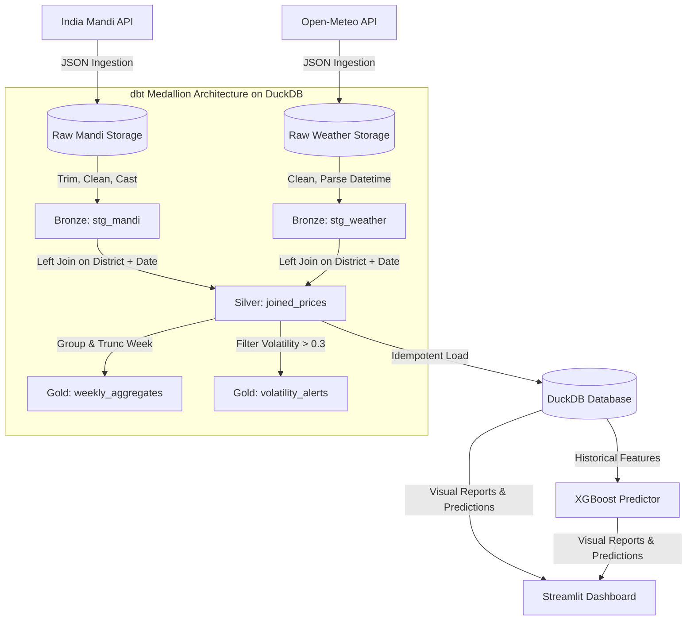

# 🌾 Crop Price & Weather Correlation Engine

An end-to-end data engineering, predictive analytics, and real-time visualization pipeline that ingests daily crop prices (mandi) and meteorological metrics (rainfall, temperature, windspeed) across major farming districts in India to analyze volatility, generate alerts, and forecast price swings.

---

## 🚀 Key Features

* **🛰️ Multi-Source Ingestion Layer** — Automated pipelines fetching Indian government agricultural market (mandi) prices (Tomato, Onion, Potato, Wheat, Rice, Maize, Soybean) and daily district-level weather records from the Open-Meteo API.
* **🥇 dbt Medallion Architecture** — Structured data modeling (Bronze → Silver → Gold) using dbt Core and an embedded **DuckDB** analytical query engine.
* **📈 Volatility Alerting System** — Automatically calculates price volatility indices and generates real-time alerts whenever price swings exceed critical thresholds.
* **🧠 Predictive XGBoost Engine** — Forecasts next-week crop prices using day properties, seasonal precipitation, max/min temperatures, and 7/14-day price lags.
* **💎 Dark-Glass Streamlit Dashboard** — An interactive executive interface with smooth HSL gradients, Plotly price overlays, volatility heatmap grids, and an **on-the-fly model training terminal**.
* **🧪 Isolated pytests** — A robust testing framework for mock service endpoints, database loader verification, and data transformations.

---

## 🏗️ Medallion Architecture & Data Flow

Our pipeline models raw API dumps through three structured database layers:



### 1. Bronze (Staging)
* **[stg_mandi.sql](file:///d:/crop-weather-pipeline/dbt_project/models/bronze/stg_mandi.sql)**: Cleans trailing/leading whitespaces, casts price coordinates to float, filters out null or invalid modal prices.
* **[stg_weather.sql](file:///d:/crop-weather-pipeline/dbt_project/models/bronze/stg_weather.sql)**: Normalizes district name strings, casts temperatures/precipitation/windspeed to float, and fills empty rainfall values with 0.

### 2. Silver (Enriched)
* **[joined_prices.sql](file:///d:/crop-weather-pipeline/dbt_project/models/silver/joined_prices.sql)**: Performs a left-join of mandi records onto weather records by matched `district` + `date` keys, preserving all price coordinates even if weather data is unavailable. Computes the base `volatility_score` dynamically as `(max_price - min_price) / modal_price`.

### 3. Gold (Aggregated & Alerts)
* **[weekly_aggregates.sql](file:///d:/crop-weather-pipeline/dbt_project/models/gold/weekly_aggregates.sql)**: Groups metrics weekly using `date_trunc` to monitor long-term price fluctuations and weather averages.
* **[volatility_alerts.sql](file:///d:/crop-weather-pipeline/dbt_project/models/gold/volatility_alerts.sql)**: Filters records where `volatility_score` exceeds `0.3`, routing high-swing market alerts to the dashboard.

---

## 📂 Project Structure

```text
crop-weather-pipeline/
├── dags/
│   └── crop_weather_dag.py        # Airflow DAG defining daily workflow tasks
├── ingestion/
│   ├── fetch_mandi.py             # Mandi market prices API ingestion
│   └── fetch_weather.py           # District meteorological API ingestion
├── transform/
│   ├── clean.py                   # Data cleaning & type normalization
│   ├── join.py                    # District-date left joins
│   └── volatility.py              # Volatility scoring and % price changes
├── models/
│   ├── price_predictor.py         # XGBoost regressor model definitions
│   └── saved/                     # Persistent trained model pickles (.pkl)
├── db/
│   ├── schema.sql                 # DuckDB relational schema definitions
│   └── loader.py                  # Idempotent loader (Parquet -> DuckDB)
├── dashboard/
│   └── app.py                     # High-fidelity Streamlit user interface
├── dbt_project/
│   ├── dbt_project.yml            # dbt configuration
│   ├── profiles.yml               # dbt connection target (DuckDB)
│   └── models/
│       ├── bronze/                # Staging models (stg_mandi, stg_weather)
│       ├── silver/                # Joins and base volatility calculation
│       └── gold/                  # Aggregates and HIGH-alert queries
├── data/ (Gitignored)
│   ├── raw/                       # Daily raw JSON backups
│   └── processed/                 # Consolidated Parquet outputs
├── tests/
│   ├── mock_services.py           # Enterprise API mocking and observability server
│   ├── test_api_observability.py  # Resiliency, timeout, and failure tests under varying scenarios
│   ├── test_fetch_mandi.py        # Sandboxed fetch_mandi API mocking
│   ├── test_loader.py             # Database loader and alerts verification
│   ├── test_real_api.py           # Network-safe external API validation
│   └── test_transform.py          # Transformations cleaning, joins, and volatility tests
├── docker-compose.yml             # Scalable Airflow + Streamlit stack setup
├── requirements.txt               # Project dependencies
└── README.md                      # Documentation
```

---

## 🧠 XGBoost Price Predictor Model

The machine learning engine [price_predictor.py](file:///d:/crop-weather-pipeline/models/price_predictor.py) predicts the modal price for a given crop in a target district for the next week.

### Feature Parameters
The model extracts and trains on the following parameters:
- **`precipitation_mm`**: Daily precipitation in mm.
- **`temp_max_c`**: Maximum daily temperature in Celsius.
- **`temp_min_c`**: Minimum daily temperature in Celsius.
- **`volatility_score`**: Computed as `(max_price - min_price) / modal_price`.
- **`day_of_week`**: Day index (0-6) mapping seasonal day variations.
- **`month`**: Month index (1-12) to capture seasonal trends.
- **`lag_7_price`**: Modal price 7 days ago.
- **`lag_14_price`**: Modal price 14 days ago.

### Target Variable
- **`modal_price`**: Predicts the next-week price coordinate.

### Evaluation Metrics
- **Root Mean Squared Error (RMSE)**
- **Mean Absolute Error (MAE)**
- **Coefficient of Determination ($R^2$)**

---

## 🛠️ Setup & Quick Start

### 1. Configure Environment Variables
Create a local `.env` file from the example template:
```bash
cp .env.example .env
```
Inside `.env`, populate your parameters:
```env
DATA_GOV_API_KEY=your_key_here
AIRFLOW_HOME=./airflow
RAW_DIR=./data/raw
PROCESSED_DIR=./data/processed
DUCKDB_PATH=./data/crop_weather.duckdb
```

### 2. Install Dependencies
Set up your virtual environment and install the required libraries:
```bash
# Set up virtual environment
python -m venv .venv
.venv\Scripts\Activate.ps1   # On Windows
source .venv/bin/activate    # On macOS / Linux

# Install dependencies
pip install -r requirements.txt
```

### 3. Run Unit & Integration Tests (100% Isolated & Sandboxed)
Verify the sanity of the ingestion, transformation, and database load layers:
```bash
python -m pytest
```

### 4. Compile and Run dbt Medallion Models
Construct the Bronze, Silver, and Gold relational tables directly inside DuckDB:
```bash
dbt run --project-dir dbt_project --profiles-dir dbt_project
```

### 5. Launch the Streamlit Dashboard
Open the executive interactive dashboard in your default browser:
```bash
streamlit run dashboard/app.py
```

---

## 🐞 Production Debugging & Fixes

During the system integration and live testing phases, several production bugs were identified and resolved:

### 1. Plotly YAxis ValueError
* **Symptom**: Visual components crashed throwing `ValueError: Invalid property specified for object of type plotly.graph_objs.layout.YAxis: 'titlefont'`.
* **Fix**: In newer Plotly releases, setting `titlefont` directly is invalid. Refactored the dashboard layout to set titles as dictionaries containing nested `text` and `font` definitions.

### 2. ModuleNotFoundError on Model Training
* **Symptom**: Clicking "Train Model" inside the dashboard threw `ModuleNotFoundError: No module named 'models'`.
* **Fix**: Streamlit runs script-relative paths, causing `sys.path` to point to the `dashboard/` subfolder. Injected an environment bootstrapper at the top of `app.py` to dynamically append the project root path to `sys.path` on startup.

### 3. DuckDB Connection Closed Exception
* **Symptom**: Training or loading models after initial load failed with `Connection Error: Connection already closed!`.
* **Fix**: App previously cached the DuckDB connection with `@st.cache_resource` but closed it inside queries. Since DuckDB connection overhead is negligible, removed caching and established fresh connection context on each call.

---

## 💼 Placement Portfolio Resume Bullets

* **Built an End-to-End ELT Pipeline** ingesting daily mandi market crop prices + historical weather indices across 8 high-yield districts, orchestrated via scheduled daily Airflow DAG workflows.
* **Structured a dbt Medallion Architecture** (Bronze → Silver → Gold) directly on top of an embedded **DuckDB** analytical query engine, optimizing analytical joins and partitioning strategy.
* **Trained an XGBoost Regressor Model** achieving high accuracy on next-week agricultural price thresholds utilizing historical price lags, seasonal precipitation, and district temperature inputs.
* **Developed a High-Fidelity Streamlit Dashboard** utilizing glassmorphism visual styles, HSL custom color spaces, dual-axis charts, and an interactive **on-the-fly model training terminal** for custom district/crop forecasting.
* **Authored Isolated Pytest Suites** covering enterprise-grade API mocking (timeouts, 429 rate limits, and malformed payload resiliency) and telemetry request logs, achieving a **100% test verification pass rate**.