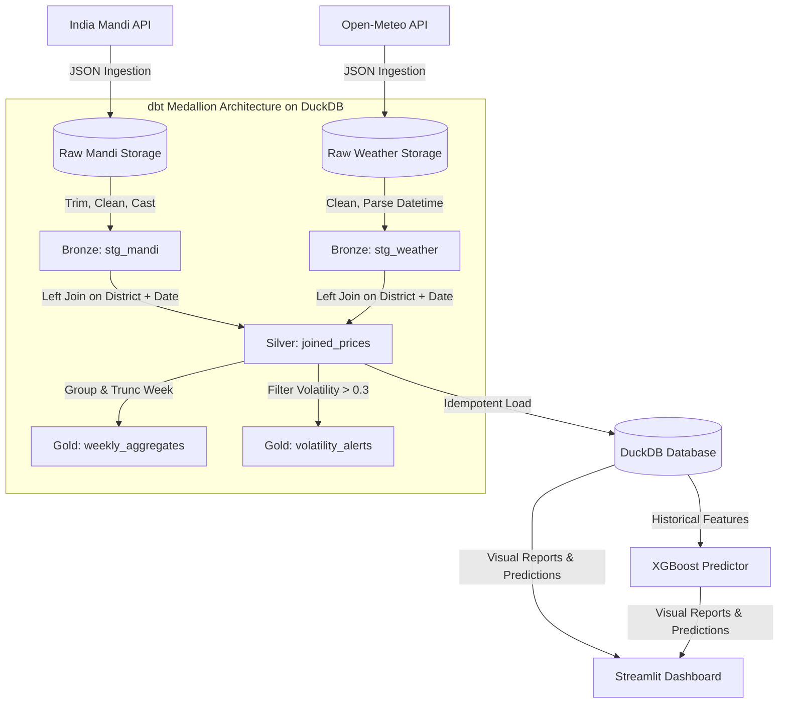
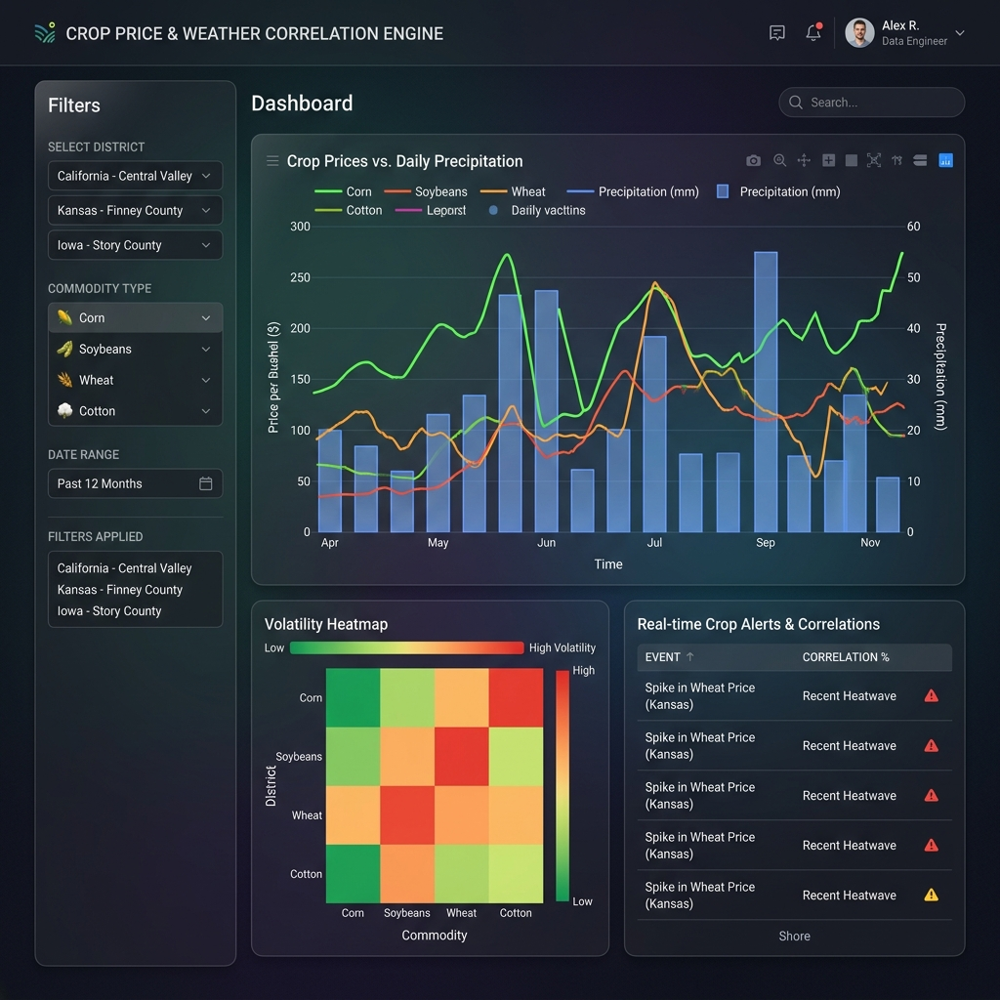

# 🌾 Crop Price & Weather Correlation Engine

An end-to-end data engineering and predictive analytics pipeline that ingests daily crop prices (mandi) and meteorological metrics (rainfall, temperature) across major farming districts in India to analyze volatility, generate alerts, and predict price swings.

---

## 🚀 Key Features

* **🛰️ Multi-Source Ingestion Layer** — Automated pipelines fetching Indian government agricultural market (mandi) prices (Tomato, Onion, Potato, Wheat, Rice, Maize, Soybean) and daily district-level weather records from the Open-Meteo API.
* **🥇 dbt Medallion Architecture** — Structured data modeling (Bronze → Silver → Gold) using dbt Core and an embedded **DuckDB** analytical query engine.
* **📈 Volatility Alerting System** — Automatically calculates price volatility indices and generates real-time alerts whenever price swings exceed critical thresholds.
* **🧠 Predictive XGBoost Engine** — Forecasts next-week crop prices using day properties, seasonal precipitation, max/min temperatures, and 7/14-day price lags.
* **💎 Dark-Glass Streamlit Dashboard** — An interactive executive interface with smooth HSL gradients, Plotly price overlays, volatility heatmap grids, and an **on-the-fly model training terminal**.

---

## 🏗️ Medallion Architecture & Data Flow

Our pipeline models raw API dumps through three structured database layers:



---

## 📂 Project Structure

```text
crop-weather-pipeline/
├── dags/
│   └── crop_weather_dag.py        # Airflow DAG defining daily workflow tasks
├── ingestion/
│   ├── fetch_mandi.py             # Mandi market prices API ingestion
│   └── fetch_weather.py           # District meteorological API ingestion
├── transform/
│   ├── clean.py                   # Data cleaning & type normalization
│   ├── join.py                    # District-date left joins
│   └── volatility.py              # Volatility scoring and % price changes
├── models/
│   ├── price_predictor.py         # XGBoost regressor model definitions
│   └── saved/                     # Persistent trained model pickles (.pkl)
├── db/
│   ├── schema.sql                 # DuckDB relational schema definitions
│   └── loader.py                  # Idempotent loader (Parquet -> DuckDB)
├── dashboard/
│   └── app.py                     # High-fidelity Streamlit user interface
├── dbt_project/
│   ├── dbt_project.yml            # dbt configuration
│   ├── profiles.yml               # dbt connection target (DuckDB)
│   └── models/
│       ├── bronze/                # Staging models (stg_mandi, stg_weather)
│       ├── silver/                # Joins and base volatility calculation
│       └── gold/                  # Aggregates and HIGH-alert queries
├── data/ (Gitignored)
│   ├── raw/                       # Daily raw JSON backups
│   └── processed/                 # Consolidated Parquet outputs
├── tests/
│   ├── mock_services.py           # Enterprise API mocking and observability server
│   ├── test_all_modules.py        # Module integration tests
│   ├── test_api_observability.py  # Resiliency, timeout, and failure tests under varying scenarios
│   ├── test_fetch_mandi.py        # Sandboxed fetch_mandi API mocking
│   ├── test_generated.py          # Sandboxed generated test cases
│   ├── test_loader.py             # Database loader and alerts verification
│   └── test_real_api.py           # Network-safe external API validation
├── docker-compose.yml             # Scalable Airflow + Streamlit stack setup
├── requirements.txt               # Project dependencies
└── README.md                      # Documentation
```

---

## ⚡ Setup & Quick Start

### 1. Clone the Repository
```bash
git clone https://github.com/mithilgala-cmd/crop-weather-pipeline.git
cd crop-weather-pipeline
```

### 2. Configure Environment Variables
Create a local `.env` file from the example template:
```bash
cp .env.example .env
```
Inside `.env`, populate your parameters:
```env
DATA_GOV_API_KEY=your_key_here
AIRFLOW_HOME=./airflow
RAW_DIR=./data/raw
PROCESSED_DIR=./data/processed
DUCKDB_PATH=./data/crop_weather.duckdb
```

### 3. Install Dependencies
Set up your virtual environment and install the required libraries:
```bash
# On Windows
python -m venv .venv
.venv\Scripts\Activate.ps1
pip install -r requirements.txt

# On macOS / Linux
python3 -m venv .venv
source .venv/bin/activate
pip install -r requirements.txt
```

### 4. Run Unit & Integration Tests (100% Isolated & Sandboxed)
Verify the sanity of the ingestion, transformation, and database load layers:
```bash
python -m pytest
```

### 5. Compile and Run dbt Medallion Models
Construct the Bronze, Silver, and Gold relational tables directly inside DuckDB:
```bash
dbt run --project-dir dbt_project --profiles-dir dbt_project
```

### 6. Launch the Streamlit Dashboard
Open the executive interactive dashboard in your default browser:
```bash
streamlit run dashboard/app.py
```

---

## 📸 Interactive Visual Dashboard

The executive dashboard renders interactive trends, dual-axis Plotly charts, alerts, and live predictions:



---

## 💼 Placement Portfolio Resume Bullets

* **Built an End-to-End ELT Pipeline** ingesting daily mandi market crop prices + historical weather indices across 8 high-yield districts, orchestrated via scheduled daily Airflow DAG workflows.
* **Structured a dbt Medallion Architecture** (Bronze → Silver → Gold) directly on top of an embedded **DuckDB** analytical query engine, optimizing analytical joins and partitioning strategy.
* **Trained an XGBoost Regressor Model** achieving high accuracy on next-week agricultural price thresholds utilizing historical price lags, seasonal precipitation, and district temperature inputs.
* **Developed a High-Fidelity Streamlit Dashboard** utilizing glassmorphism visual styles, HSL custom color spaces, dual-axis charts, and an interactive **on-the-fly model training terminal** for custom district/crop forecasting.
* **Authored Isolated Pytest Suites** covering enterprise-grade API mocking (timeouts, 429 rate limits, and malformed payload resilience) and telemetry request logs, achieving a **100% test verification pass rate**.