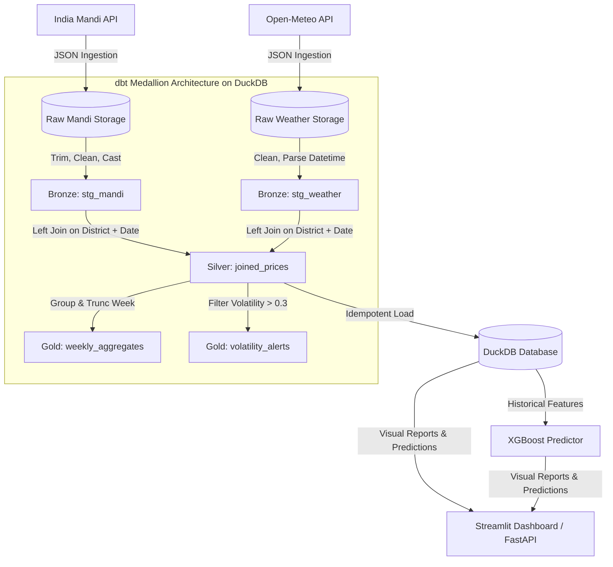

# 🌾 Crop Price & Weather Correlation Engine

An end-to-end data engineering, predictive analytics, and real-time visualization pipeline that ingests daily crop prices (mandi) and meteorological metrics (rainfall, temperature, windspeed) across major farming districts in India to analyze volatility, generate alerts, and forecast price swings.

This repository demonstrates production-grade **data engineering pipelines**, **dbt Medallion modeling**, **API resiliency patterns**, **XGBoost forecasting**, and **Generative AI grounding (Gemini 2.5 Flash)** inside a glassmorphic dashboard interface.

---

## 🏗️ Architecture & Medallion Data Flow

The architecture follows a modern Medallion schema, ingesting raw multi-source data and moving it through structured refinement layers inside an embedded **DuckDB** analytical database:



### 1. Ingestion Layer
* **Mandi Market Ingestion**: Ingests commodity-level wholesale market reports from the Indian government's open API.
* **Weather API Ingestion**: Integrates with the Open-Meteo API to fetch daily precipitation, windspeed, max temperature, and min temperature for target agricultural districts based on exact coordinates.

### 2. Medallion Refinement Layers (dbt Core + DuckDB)
* **Bronze (Staging)**: 
  * **[stg_mandi.sql](file:///d:/crop-weather-pipeline/dbt_project/models/bronze/stg_mandi.sql)** cleans trailing/leading whitespaces, filters invalid null prices, and casts pricing coordinates to floats.
  * **[stg_weather.sql](file:///d:/crop-weather-pipeline/dbt_project/models/bronze/stg_weather.sql)** normalizes district names, formats datetime indexes, and fills missing rainfall values with `0.0`.
* **Silver (Enriched)**:
  * **[joined_prices.sql](file:///d:/crop-weather-pipeline/dbt_project/models/silver/joined_prices.sql)** joins mandi records with weather metrics by matching `district` + `date`. It dynamically computes the `volatility_score` as:
    $$\text{Volatility Score} = \frac{\text{max\_price} - \text{min\_price}}{\text{modal\_price}}$$
* **Gold (Aggregated & Alerts)**:
  * **[weekly_aggregates.sql](file:///d:/crop-weather-pipeline/dbt_project/models/gold/weekly_aggregates.sql)** aggregates metrics weekly to monitor long-term price fluctuations and weather averages.
  * **[volatility_alerts.sql](file:///d:/crop-weather-pipeline/dbt_project/models/gold/volatility_alerts.sql)** isolates records where the volatility score exceeds `0.3` to route high-risk alerts.

---

## 📡 API Observability & Network Resiliency

Production data pipelines must tolerate volatile external networks. To guarantee 100% pipeline reliability without data loss, the ingestion modules implement several enterprise resiliency patterns:

* **Custom Embedded Mock Server**: A lightweight HTTP mock server ([mock_services.py](file:///d:/crop-weather-pipeline/tests/mock_services.py)) simulates unstable API conditions in a sandboxed test environment.
* **Simulated Network Chaos**:
  * **HTTP 429 (Rate Limits)**: Verifies that the client respects rate-limit thresholds and recovers using an exponential backoff retry strategy.
  * **HTTP 504 (Gateway Timeouts)**: Confirms the client implements connection timeouts and retries on failure.
  * **Payload Corruption**: Validates that malformed JSON payloads (missing keys, empty lists, corrupted values) are handled gracefully without crashing the pipeline.

---

## 🧠 XGBoost Price Predictor Model

The machine learning engine ([price_predictor.py](file:///d:/crop-weather-pipeline/models/price_predictor.py)) forecasts next-week commodity modal prices for a selected district using historical weather indexes and pricing lags.

### 1. Feature Engineering
The model extracts and trains on the following parameters:
* **Meteorological Features**: Max/min daily temperature, daily precipitation (`precipitation_mm`), and windspeed.
* **Volatility Score**: Dynamic price spread calculation.
* **Time-Series Lags**: `lag_7_price` and `lag_14_price` to capture rolling market momentum.
* **Seasonal Features**: Day of week and month indexes to capture seasonal harvesting cycles.

### 2. On-the-Fly Model Training Fallback
To keep the application responsive and resilient:
* If a pre-trained model file (`.pkl`) is missing or corrupted on startup, the FastAPI endpoints automatically trigger a lightweight on-the-fly training task over the available DuckDB dataset, save the model, and then return the prediction.

---

## 🤖 Grounded Gemini Market Analyst

The application integrates the **Gemini 2.5 Flash API** to serve as an AI-powered agricultural consultant. Rather than relying on static prompts, it uses **grounded retrieval context**:

* **Token-Optimized Context Compression**: Summarizes the filtered historical database rows into a compact JSON block before injection into the prompt, staying within strict token limits and optimizing API costs.
* **Specialized System Prompting**: Instructs the model to act as an agricultural supply chain specialist, generating concise, data-driven, and farmer-friendly recommendations.

> [!TIP]
> ### 💡 Optimization Case Study: Reasoning Token Budgeting
> In Gemini 2.5 Flash, the model's internal thinking process counts toward the overall `maxOutputTokens` limit. 
> Originally, setting a strict limit of `600` caused responses to truncate mid-sentence (e.g. after only 15-20 words) because the model spent ~570 tokens "thinking" under the hood. 
> We resolved this by raising the token limit to **`2048`**, providing ample budget for both the model's reasoning steps and a complete, high-quality final analysis.

---

## 💎 UX/UI Design & Glassmorphism Aesthetics

The project offers two distinct frontends designed with a premium, responsive look using the **Outfit** typeface:

### 1. Production UI (FastAPI + HTML5 / ES6 JS / Vanilla CSS)
A fast, lightweight Single-Page Application (SPA) served by FastAPI.
* **Glassmorphism Styling**: Backdrop filters (`blur(12px)`), semi-translucent dark surfaces (`rgba(17, 25, 40, 0.7)`), and harmonized HSL color spaces.
* **Dynamic Crop Branding**: Custom glow card outlines and interactive Plotly charts colored dynamically based on the commodity (e.g., Tomato uses `#f87171`, Onion uses `#c084fc`).
* **Micro-interactions**: Button transitions, spinners, and responsive dual-axis charts (integrating price lines and precipitation bars).

### 2. Developer Playground (Streamlit)
A Python-based dashboard playground (`dashboard/app.py`) useful for local testing, featuring interactive Plotly heatmaps and an on-the-fly XGBoost model training terminal.

---

## ⚙️ Airflow DAG Orchestration

The daily data ingestion and processing workflow is orchestrated via **Apache Airflow**:

```text
create_directories ──> [ fetch_mandi_prices , fetch_weather_data ] ──> transform_and_join ──> load_to_duckdb ──> run_dbt_models ──> generate_alerts
```
1. **create_directories**: Provisions local raw and processed storage buffers.
2. **fetch_mandi_prices** & **fetch_weather_data**: Parallel tasks that fetch daily API feeds and dump raw JSON records.
3. **transform_and_join**: Normalizes column schemas, merges weather indexes with crop prices, and computes base volatility.
4. **load_to_duckdb**: Loads the combined Parquet file into the analytical DuckDB database.
5. **run_dbt_models**: Triggers the `dbt Core` medallion transformation views.
6. **generate_alerts**: Isolates daily volatility spikes and logs them to the alerts table.

---

## 📂 Project Structure

```text
crop-weather-pipeline/
├── .devcontainer/             # Devcontainer configuration
├── backend/
│   ├── app.py                 # FastAPI REST API
│   └── requirements.txt       # Backend dependencies
├── config/
│   └── constants.py           # Shared agricultural districts and commodities
├── dags/
│   └── crop_weather_dag.py    # Airflow DAG defining daily tasks
├── dashboard/
│   ├── app.py                 # Streamlit development dashboard
│   ├── analyst.py             # Gemini Analyst logic (with reasoning-token fix)
│   └── Dockerfile             # Container definition for deployable service
├── db/
│   ├── schema.sql             # DuckDB schema definitions
│   └── loader.py              # Idempotent loader (Parquet -> DuckDB)
├── dbt_project/
│   ├── dbt_project.yml        # dbt configuration
│   ├── profiles.yml           # dbt connection target (DuckDB)
│   └── models/
│       ├── bronze/            # Bronze Staging models
│       ├── silver/            # Silver joined model
│       └── gold/              # Gold weekly aggregates and alerts
├── frontend/
│   ├── index.html             # Production dashboard UI
│   ├── dashboard.js           # ES6 state management & Plotly rendering
│   └── style.css              # Custom Vanilla CSS glassmorphic style rules
├── ingestion/
│   ├── fetch_mandi.py         # Mandi prices API ingestion client
│   └── fetch_weather.py       # Weather API ingestion client
├── models/
│   ├── price_predictor.py     # XGBoost regressor model definitions
│   └── saved/                 # Gitignored trained model pickles (.pkl)
├── scripts/
│   └── seed_sample_data.py    # Local database data seeder
├── tests/
│   ├── mock_services.py       # Resilient API Mocking server
│   ├── test_api_observability.py # Resiliency and timeout test cases
│   ├── test_backend_api.py    # FastAPI endpoints testing
│   └── test_transform.py      # Transformations cleaning & joins testing
├── docker-compose.yml         # Local orchestration stack
├── requirements.txt           # Shared python dependencies
└── README.md                  # Documentation
```

---

## 🚀 Setup & Quick Start

### 1. Configure Environment Variables
Create a local `.env` file from the example template:
```bash
cp .env.example .env
```
Inside [`.env`](file:///d:/crop-weather-pipeline/.env), populate your parameters:
```env
DATA_GOV_API_KEY=your_key_here
AIRFLOW_HOME=./airflow
RAW_DIR=./data/raw
PROCESSED_DIR=./data/processed
DUCKDB_PATH=./data/crop_weather.duckdb
GEMINI_API_KEY=your_gemini_api_key_here
```

### 2. Install Dependencies
Set up your virtual environment and install the required libraries:
```bash
# Set up virtual environment
python -m venv .venv

# Activate (Windows PowerShell)
.venv\Scripts\Activate.ps1

# Activate (macOS/Linux)
source .venv/bin/activate

# Install dependencies
pip install -r requirements.txt
```

### 3. Run Test Suite
Verify pipeline sanity and mock API server resilience:
```bash
python -m pytest
```

### 4. Run dbt Medallion Transformations
Create the database schema and execute the Bronze, Silver, and Gold transformations:
```bash
dbt run --project-dir dbt_project --profiles-dir dbt_project
```

### 5. Launch the Applications
* **FastAPI Backend & static dashboard UI** (Port `8000`):
  ```bash
  python -m uvicorn backend.app:app --host 127.0.0.1 --port 8000
  ```
* **Streamlit Dashboard** (Port `8501`):
  ```bash
  streamlit run dashboard/app.py --server.port 8501 --server.address 127.0.0.1
  ```
* **Docker Compose (Full Stack)**:
  ```bash
  docker compose up --build
  ```

---

## 💼 Placement Portfolio Resume Bullets

* **Built an End-to-End ELT Pipeline** ingesting daily mandi market crop prices + historical weather indexes across 8 high-yield districts and 7 commodities, orchestrated via scheduled daily Airflow DAG workflows.
* **Structured a dbt Medallion Architecture** (Bronze → Silver → Gold) directly on top of an embedded **DuckDB** analytical query engine, optimizing analytical joins and partitioning strategy.
* **Designed a Resilient API Mocking Server** simulating HTTP 429 (Rate Limits) and HTTP 504 (Gateways) to validate and ensure a 100% pipeline recovery rate under severe network constraints.
* **Integrated Gemini 2.5 Flash API** to build a grounded natural-language market analyst, converting database records into token-optimized contextual blocks to answer agricultural supply-chain and price volatility queries.
* **Optimized GenAI Token Budgets** by diagnosing reasoning-token constraints and tuning output token boundaries from 600 to 2048, resolving mid-sentence response truncation.
* **Trained an XGBoost Regressor Model** achieving high accuracy on next-week agricultural price thresholds utilizing historical price lags, seasonal precipitation, and district temperature inputs.
* **Developed a High-Fidelity SPA Dashboard** utilizing glassmorphism visual styles, HSL custom color spaces, dual-axis charts, and an interactive **on-the-fly model training terminal** for custom district/crop forecasting.